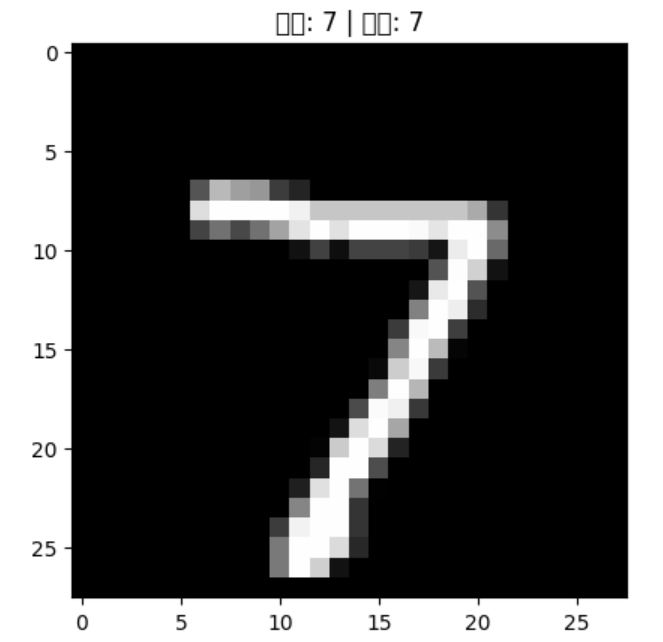

# 手写数字识别项目

本项目使用 TensorFlow 和 Keras，在 Jupyter Notebook 中实现经典的手写数字识别（MNIST）任务。

## 项目背景

MNIST 是机器学习领域最知名的公开手写数字数据集，包含 28x28 像素灰度图片，标签为 0~9。该项目旨在掌握数据加载、预处理、神经网络模型构建、训练与评估，以及代码工程化和项目展示能力。

## 环境配置

- Python 3.10（虚拟环境）
- TensorFlow 2.21.0
- Keras（随TensorFlow集成）
- matplotlib（用来绘图）
- Jupyter Notebook

## 虚拟环境创建流程（Windows）

# 创建并激活虚拟环境（PowerShell）
python -m venv venv
.\venv\Scripts\Activate

# 安装必备包
pip install tensorflow matplotlib notebook

## 项目流程

### 1. 加载数据集

直接使用 keras 内置的 mnist 数据集，无需下载其他资源。

### 2. 可视化与数据分析

用 matplotlib 展示图片和标签，理解数据结构。

### 3. 数据预处理

归一化像素到 0~1，提高训练效率：

### 4. 构建神经网络模型

### 5. 模型训练与验证

### 6. 模型评估

### 7. 预测与可视化输出

## 项目结果

测试集准确率： 0.9765999913215637
- 可以准确识别大多数手写数字图片
- 完整结果可浏览 Jupyter Notebook 文件，代码与可视化全部展示。
- 支持自定义图片批量预测、模型结构扩展

## 运行效果截图

 

## 项目心得与收获

- 第一次体验了人工智能项目的完整流程
- 学会了虚拟环境管理、包安装、环境迁移
- 熟悉了Jupyter Notebook交互式开发和工程报告能力
